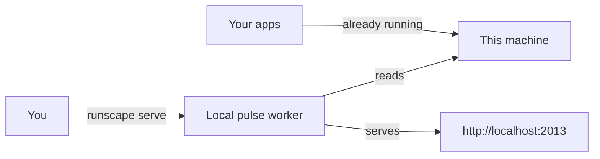
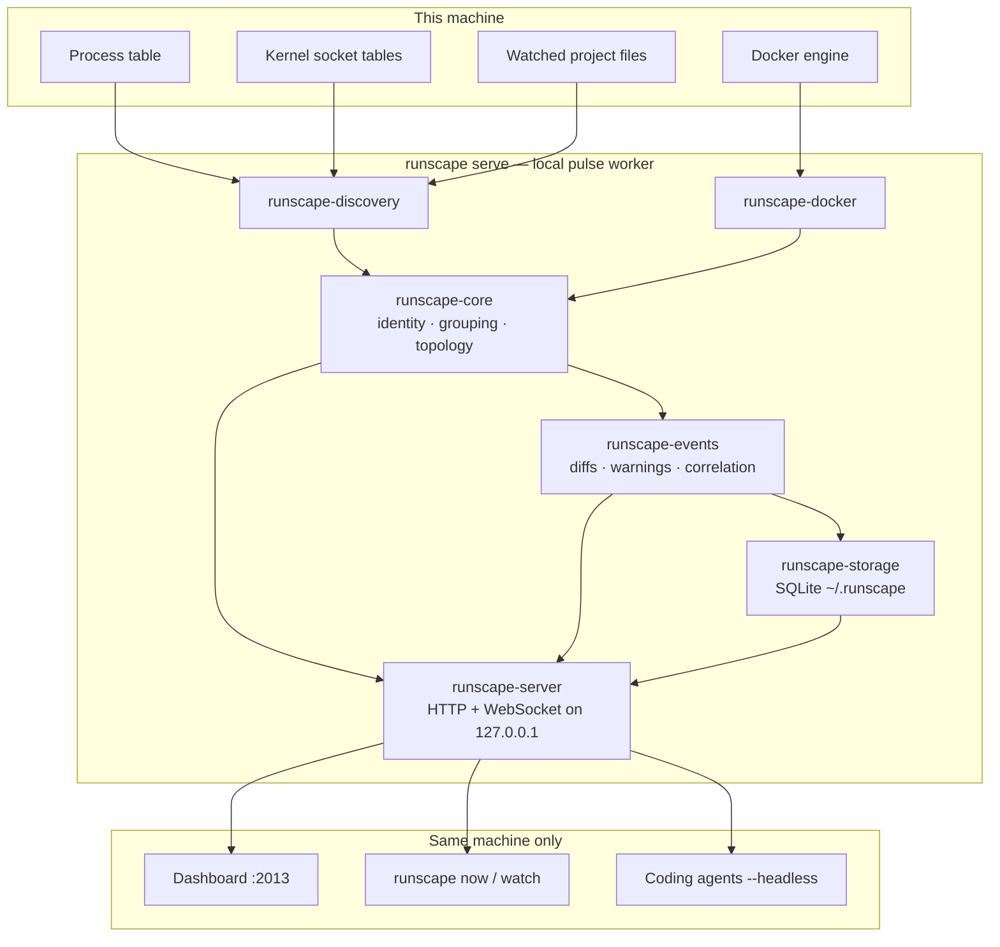
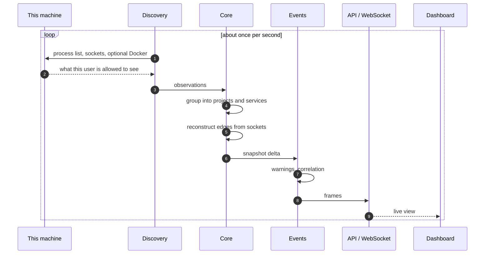
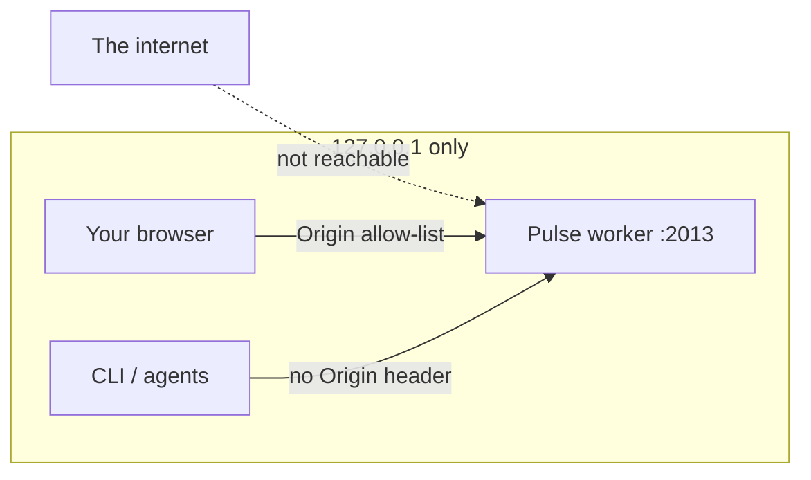

# Runscape

[](LICENSE)
[](https://www.rust-lang.org)

One command. A live picture of what your local code is already doing — processes, ports, containers, who talks to whom, and what moved just before something broke.

```bash
cargo install --git https://github.com/prasiddhnaik/DEVpluse.git --locked runscape-cli
runscape serve
```

Opens **http://localhost:2013**. No config file. No SDK in your app. No account. Nothing leaves the machine.

The GitHub repository is still named `DEVpluse`. The product, binary, and crates are **Runscape**.

---

## Install

You need a Rust toolchain **1.85 or newer** (`rustc -V`). If you do not have one:

```bash
curl --proto '=https' --tlsv1.2 -sSf https://sh.rustup.rs | sh
source "$HOME/.cargo/env"
```

Then install the `runscape` binary from this repo (not crates.io yet):

```bash
cargo install --git https://github.com/prasiddhnaik/DEVpluse.git --locked runscape-cli
runscape --version
runscape serve
```

That compiles the workspace, bakes the dashboard into the binary, and puts `runscape` on your `PATH` (`~/.cargo/bin`). First install takes a few minutes; later ones are incremental.

| You have | Do this |
| --- | --- |
| Rust 1.85+ | `cargo install --git https://github.com/prasiddhnaik/DEVpluse.git --locked runscape-cli` |
| A clone of this repo | `cargo install --path crates/runscape-cli --locked` |
| An existing install | the same `cargo install --git …` command; Cargo replaces the binary |

macOS and Linux are the supported observers. Unprivileged, Runscape only sees **your** processes.

Uninstall:

```bash
cargo uninstall runscape-cli
rm -rf ~/.runscape          # optional: local history
```

---

## Quick start

```bash
runscape serve              # dashboard + API on loopback :2013
runscape serve --headless   # same worker, JSON ready line, no browser
runscape serve --no-open    # print the URL, do not open a browser
```

Then start a dev server in a git repo. Within about a second it should appear as a project.



Useful flags for `serve`:

| Flag / env | Meaning |
| --- | --- |
| `--port <n>` / `RUNSCAPE_PORT` | Port. Bind address is always `127.0.0.1`. |
| `--interval <secs>` | Snapshot interval. Default 1s. |
| `--db <path>` | History SQLite file. Default `~/.runscape/runscape.db`. |
| `--no-persistence` | Memory only; write nothing to disk. |
| `--no-docker` | Skip the Docker probe. |
| `--docker-stats` | Per-container CPU/memory. Costs ~1s per batch. |
| `--headless` | Agents: wait for the first snapshot, print one JSON ready line. |
| `--no-open` | Do not open a browser. |

One-shot commands (no worker required):

```bash
runscape scan-processes
runscape scan-sockets
runscape scan-projects
runscape resolve-project .
runscape capabilities
runscape bench
```

Against a running worker (compact JSON, for agents — see [`docs/for-agents.md`](docs/for-agents.md)):

```bash
runscape now --here
runscape watch
```

---

## What it shows

* **Projects** — processes grouped by the repository or workspace they run in, from each process's working directory, with evidence and a confidence.
* **Services** — a stable identity per logical service that survives a restart. A PID does not.
* **Topology** — service-to-service edges from the kernel's socket tables. Every edge carries evidence type, confidence, and first/last seen.
* **Containers** — Docker containers in the same graph, keyed by Compose labels so `docker compose up` does not mint a new identity.
* **Resources** — CPU, RSS, virtual memory, threads, per-tick disk I/O, observed connection counts. Project pages sum the services in that project per tick.
* **Events and warnings** — starts, stops, restarts, ports, health, file saves; plus deterministic rules for restart loops, sustained CPU, one-way memory growth, degraded health, port conflicts.
* **What changed** — click an event to see what happened around it, labelled with *why* it is related. Adjacency, never cause.

Not a Datadog clone, not Docker Desktop, not a process manager, not a packet sniffer. It observes and reports. It starts and stops nothing.

---

## How it is built

One OS process. Discovery, grouping, the HTTP/WebSocket API, and the dashboard all live inside `runscape serve`. The dashboard is a renderer: if a number is on screen, the worker said it.



Each tick is a read of the OS, a reconcile, then a push. Nothing is inferred into a fact the OS did not provide.



Loopback is the trust boundary. The worker will not bind `0.0.0.0`.



---

## Privacy

* Binds **loopback only**. Refuses to start on any other address.
* Browser requests are origin-checked so a random website cannot read your process list.
* Environment variable **values** are never read.
* Secret-looking argv is redacted at capture. The raw command line never reaches memory the API can serve.
* Nothing is uploaded. History is one SQLite file you can delete.
* No endpoint accepts a path or a command. The API cannot be turned into a file reader or an executor.

Unprivileged on macOS and Linux:

* other users' processes disclose no cwd / argv / executable, so they are not grouped
* other users' sockets are invisible, not reported with an unknown owner
* a connection is only attributable to the accepting side after `accept()` returns, so topology lags by about one interval

`runscape capabilities` and `GET /api/v1/status` report what this OS will actually disclose.

---

## Repository

```text
crates/runscape-core        domain model, identity, grouping, registry, topology
crates/runscape-discovery   processes, sockets, file watching, platform limits
crates/runscape-events      snapshot diffing, warning rules, correlation
crates/runscape-docker      Docker inspection
crates/runscape-storage     SQLite persistence and retention
crates/runscape-server      snapshot loop, HTTP + WebSocket, embedded dashboard
crates/runscape-cli         the `runscape` binary
apps/web                    dashboard (Next.js) — baked into the binary for `serve`
docs                        API contract, product notes, agent notes
```

The visual UI is served by `runscape serve`. To iterate on React without rebuilding:

```bash
cd apps/web
bun install
bun dev                 # http://localhost:3000 → worker on :2013
```

Ship UI into the binary with `bun run export:daemon`, then rebuild `runscape-cli`.

---

## Development

```bash
cargo fmt --all --check
cargo clippy --workspace --all-targets -- -D warnings
cargo test --workspace

cd apps/web && bun run lint && bun run typecheck && bun test
```

`apps/web` includes a contract check against a *running* worker; it skips when nothing is on :2013.

Product walkthrough: [`docs/for-developers.md`](docs/for-developers.md).  
HTTP contract: [`docs/api-contract.md`](docs/api-contract.md).  
Agents: [`docs/for-agents.md`](docs/for-agents.md).

---

## License

[MIT](LICENSE)
